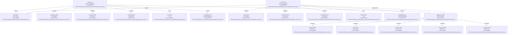
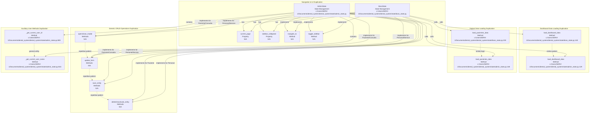

# Codebase Research Report

## Query
analssa el boss_state y el admin_state ya que creo que tienen dublicicadad es decir que tienes codigos similares y dime com lo puedo solucionar 

## Answer
# Análisis de Duplicidad en `BossState` y `AdminState`

Este informe detalla las duplicidades de código encontradas entre los estados [BossState](c:/Users/SERVI 1/Documents/dental_system/dental_system/state/boss_state.py) y [AdminState](c:/Users/SERVI 1/Documents/dental_system/dental_system/state/admin_state.py), y propone soluciones para refactorizar y mejorar la mantenibilidad del codebase.

## 1. Visión General de los Estados




### 1.1. [BossState](c:/Users/SERVI 1/Documents/dental_system/dental_system/state/boss_state.py)
*   **Propósito**: Gestiona el estado y las operaciones específicas para el rol de gerente/jefe en el sistema.
*   **Partes Internas Clave**:
    *   **Datos del Dashboard**: [dashboard_stats](c:/Users/SERVI 1/Documents/dental_system/dental_system/state/boss_state.py:24) ([DashboardStatsModel](c:/Users/SERVI 1/Documents/dental_system/dental_system/models/admin_models.py))
    *   **Gestión de Personal (CRUD)**: [personal_list](c:/Users/SERVI 1/Documents/dental_system/dental_system/state/boss_state.py:29), [personal_form](c:/Users/SERVI 1/Documents/dental_system/dental_system/state/boss_state.py:32), métodos `save_personal`, `delete_personal`, `reactivate_personal` ([c:/Users/SERVI 1/Documents/dental_system/dental_system/state/boss_state.py:469], [c:/Users/SERVI 1/Documents/dental_system/dental_system/state/boss_state.py:600], [c:/Users/SERVI 1/Documents/dental_system/dental_system/state/boss_state.py:649]).
    *   **Gestión de Servicios (CRUD)**: [servicios_list](c:/Users/SERVI 1/Documents/dental_system/dental_system/state/boss_state.py:52), [servicio_form](c:/Users/SERVI 1/Documents/dental_system/dental_system/state/boss_state.py:55), método `save_servicio` ([c:/Users/SERVI 1/Documents/dental_system/dental_system/state/boss_state.py:679]).
    *   **Vistas de Datos**: [pacientes_list](c:/Users/SERVI 1/Documents/dental_system/dental_system/state/boss_state.py:66), [consultas_list](c:/Users/SERVI 1/Documents/dental_system/dental_system/state/boss_state.py:72), [pagos_list](c:/Users/SERVI 1/Documents/dental_system/dental_system/state/boss_state.py:78).
    *   **Navegación y UI**: [current_page](c:/Users/SERVI 1/Documents/dental_system/dental_system/state/boss_state.py:19), [sidebar_collapsed](c:/Users/SERVI 1/Documents/dental_system/dental_system/state/boss_state.py:20), `navigate_to` ([c:/Users/SERVI 1/Documents/dental_system/dental_system/state/boss_state.py:120]), `toggle_sidebar` ([c:/Users/SERVI 1/Documents/dental_system/dental_system/state/boss_state.py:135]).
*   **Relaciones Externas**: Hereda de [BaseState](c:/Users/SERVI 1/Documents/dental_system/dental_system/state/base.py). Interactúa con las tablas de Supabase a través de [supabase_client](c:/Users/SERVI 1/Documents/dental_system/dental_system/supabase/client.py) y los módulos de tablas ([personal_table](c:/Users/SERVI 1/Documents/dental_system/dental_system/supabase/tablas/personal_table.py), [users_table](c:/Users/SERVI 1/Documents/dental_system/dental_system/supabase/tablas/users_table.py), [services_table](c:/Users/SERVI 1/Documents/dental_system/dental_system/supabase/tablas/services_table.py)).

### 1.2. [AdminState](c:/Users/SERVI 1/Documents/dental_system/dental_system/state/admin_state.py)
*   **Propósito**: Gestiona el estado y las operaciones específicas para el rol de administrador del sistema.
*   **Partes Internas Clave**:
    *   **Datos del Dashboard**: [admin_stats](c:/Users/SERVI 1/Documents/dental_system/dental_system/state/admin_state.py:25) ([AdminStatsModel](c:/Users/SERVI 1/Documents/dental_system/dental_system/models/admin_models.py)).
    *   **Gestión de Pacientes (CRUD)**: [pacientes_list](c:/Users/SERVI 1/Documents/dental_system/dental_system/state/admin_state.py:33), [paciente_form](c:/Users/SERVI 1/Documents/dental_system/dental_system/state/admin_state.py:37), métodos `save_paciente`, `delete_paciente`, `reactivate_paciente` ([c:/Users/SERVI 1/Documents/dental_system/dental_system/state/admin_state.py:470], [c:/Users/SERVI 1/Documents/dental_system/dental_system/state/admin_state.py:559], [c:/Users/SERVI 1/Documents/dental_system/dental_system/state/admin_state.py:588]).
    *   **Gestión de Consultas (CRUD)**: [consultas_list](c:/Users/SERVI 1/Documents/dental_system/dental_system/state/admin_state.py:77), [consulta_form](c:/Users/SERVI 1/Documents/dental_system/dental_system/state/admin_state.py:83), métodos `save_consulta`, `change_consulta_status` ([c:/Users/SERVI 1/Documents/dental_system/dental_system/state/admin_state.py:640], [c:/Users/SERVI 1/Documents/dental_system/dental_system/state/admin_state.py:710]).
    *   **Datos de Apoyo**: [odontologos_list](c:/Users/SERVI 1/Documents/dental_system/dental_system/state/admin_state.py:96), [servicios_list](c:/Users/SERVI 1/Documents/dental_system/dental_system/state/admin_state.py:97).
    *   **Navegación y UI**: [current_page](c:/Users/SERVI 1/Documents/dental_system/dental_system/state/admin_state.py:19), [sidebar_collapsed](c:/Users/SERVI 1/Documents/dental_system/dental_system/state/admin_state.py:20), `navigate_to` ([c:/Users/SERVI 1/Documents/dental_system/dental_system/state/admin_state.py:110]), `toggle_sidebar` ([c:/Users/SERVI 1/Documents/dental_system/dental_system/state/admin_state.py:125]).
*   **Relaciones Externas**: Hereda de [BaseState](c:/Users/SERVI 1/Documents/dental_system/dental_system/state/base.py). Interactúa con las tablas de Supabase a través de [supabase_client](c:/Users/SERVI 1/Documents/dental_system/dental_system/supabase/client.py) y los módulos de tablas ([pacientes_table](c:/Users/SERVI 1/Documents/dental_system/dental_system/supabase/tablas/pacientes_table.py), [consultas_table](c:/Users/SERVI 1/Documents/dental_system/dental_system/supabase/tablas/consultas_table.py), [services_table](c:/Users/SERVI 1/Documents/dental_system/dental_system/supabase/tablas/services_table.py)).

## 2. Duplicidades Identificadas




Se han identificado las siguientes áreas de duplicidad:

### 2.1. Navegación y Estado de UI
*   **`current_page`**: Presente en ambos estados ([c:/Users/SERVI 1/Documents/dental_system/dental_system/state/boss_state.py:19], [c:/Users/SERVI 1/Documents/dental_system/dental_system/state/admin_state.py:19]).
*   **`sidebar_collapsed`**: Presente en ambos estados ([c:/Users/SERVI 1/Documents/dental_system/dental_system/state/boss_state.py:20], [c:/Users/SERVI 1/Documents/dental_system/dental_system/state/admin_state.py:20]).
*   **`navigate_to`**: Lógica de navegación similar en ambos estados ([c:/Users/SERVI 1/Documents/dental_system/dental_system/state/boss_state.py:120], [c:/Users/SERVI 1/Documents/dental_system/dental_system/state/admin_state.py:110]).
*   **`toggle_sidebar`**: Idéntico en ambos estados ([c:/Users/SERVI 1/Documents/dental_system/dental_system/state/boss_state.py:135], [c:/Users/SERVI 1/Documents/dental_system/dental_system/state/admin_state.py:125]).

### 2.2. Carga de Datos del Dashboard
*   Ambos estados tienen un método `load_dashboard_data` ([c:/Users/SERVI 1/Documents/dental_system/dental_system/state/boss_state.py:140], [c:/Users/SERVI 1/Documents/dental_system/dental_system/state/admin_state.py:129]) que sigue un patrón similar de carga de estadísticas, aunque las estadísticas específicas difieren.

### 2.3. Gestión de Pacientes
*   Ambos estados cargan y muestran datos de pacientes:
    *   [BossState.load_pacientes_data](c:/Users/SERVI 1/Documents/dental_system/dental_system/state/boss_state.py:230)
    *   [AdminState.load_pacientes_data](c:/Users/SERVI 1/Documents/dental_system/dental_system/state/admin_state.py:148)
*   Aunque [AdminState](c:/Users/SERVI 1/Documents/dental_system/dental_system/state/admin_state.py) tiene una gestión CRUD completa de pacientes, la carga inicial y las estadísticas básicas tienen similitudes.

### 2.4. Operaciones CRUD Genéricas (Modales, Formularios, Guardar, Eliminar, Reactivar)
Esta es la mayor área de duplicidad. El patrón para gestionar modales, actualizar formularios, guardar (crear/actualizar), eliminar y reactivar entidades es altamente repetitivo:
*   **Apertura/Cierre de Modales**: `open_personal_modal`, `close_personal_modal` en [BossState](c:/Users/SERVI 1/Documents/dental_system/dental_system/state/boss_state.py:326) y `open_paciente_modal`, `close_paciente_modal` en [AdminState](c:/Users/SERVI 1/Documents/dental_system/dental_system/state/admin_state.py:368), `open_servicio_modal`, `close_servicio_modal` en [BossState](c:/Users/SERVI 1/Documents/dental_system/dental_system/state/boss_state.py:406), `open_consulta_modal`, `close_consulta_modal` en [AdminState](c:/Users/SERVI 1/Documents/dental_system/dental_system/state/admin_state.py:600).
*   **Actualización de Formularios**: `update_personal_form` ([c:/Users/SERVI 1/Documents/dental_system/dental_system/state/boss_state.py:457]), `update_servicio_form` ([c:/Users/SERVI 1/Documents/dental_system/dental_system/state/boss_state.py:461]), `update_paciente_form` ([c:/Users/SERVI 1/Documents/dental_system/dental_system/state/admin_state.py:466]), `update_consulta_form` ([c:/Users/SERVI 1/Documents/dental_system/dental_system/state/admin_state.py:636]).
*   **Lógica de Guardado (Crear/Actualizar)**: `save_personal` ([c:/Users/SERVI 1/Documents/dental_system/dental_system/state/boss_state.py:469]), `save_servicio` ([c:/Users/SERVI 1/Documents/dental_system/dental_system/state/boss_state.py:679]), `save_paciente` ([c:/Users/SERVI 1/Documents/dental_system/dental_system/state/admin_state.py:470]), `save_consulta` ([c:/Users/SERVI 1/Documents/dental_system/dental_system/state/admin_state.py:640]). Todos siguen el patrón de verificar si es una entidad existente o nueva y llamar a métodos internos (`_create_`, `_update_`).
*   **Lógica de Eliminación/Reactivación**: `delete_personal` ([c:/Users/SERVI 1/Documents/dental_system/dental_system/state/boss_state.py:600]), `reactivate_personal` ([c:/Users/SERVI 1/Documents/dental_system/dental_system/state/boss_state.py:649]), `delete_paciente` ([c:/Users/SERVI 1/Documents/dental_system/dental_system/state/admin_state.py:559]), `reactivate_paciente` ([c:/Users/SERVI 1/Documents/dental_system/dental_system/state/admin_state.py:588]).

### 2.5. Métodos Auxiliares de Usuario
*   `_get_current_user_id` ([c:/Users/SERVI 1/Documents/dental_system/dental_system/state/admin_state.py:809]) y `_get_current_user_name` ([c:/Users/SERVI 1/Documents/dental_system/dental_system/state/admin_state.py:815]) son utilidades generales que podrían residir en [BaseState](c:/Users/SERVI 1/Documents/dental_system/dental_system/state/base.py).

## 3. Soluciones Propuestas

```mermaid
graph TB
  baseState["BaseState<br>Base Class<br>c:/Users/SERVI 1/Documents/dental_system/dental_system/state/base.py"]
  bossState["BossState<br>State Management<br>c:/Users/SERVI 1/Documents/dental_system/dental_system/state/boss_state.py"]
  adminState["AdminState<br>State Management<br>c:/Users/SERVI 1/Documents/dental_system/dental_system/state/admin_state.py"]
  mixinsModule["Mixins Module<br>New File<br>dental_system/state/mixins.py"]

  subgraph Centralize Navigation & UI
    navUiProps["current_page, sidebar_collapsed<br>Properties<br>N/A"]
    navUiMethods["navigate_to, toggle_sidebar<br>Methods<br>N/A"]

    navUiProps --> |"move to"| baseState
    navUiMethods --> |"move to"| baseState
    baseState --> |"provides"| navUiProps
    baseState --> |"provides"| navUiMethods
    bossState --> |"inherits from"| baseState
    adminState --> |"inherits from"| baseState
  end

  subgraph Abstract Generic CRUD with Mixins
    crudFormMixin["CrudFormMixin<br>Mixin Class<br>dental_system/state/mixins.py"]
    crudOperationsMixin["CrudOperationsMixin<br>Mixin Class<br>dental_system/state/mixins.py"]

    mixinsModule --> |"contains"| crudFormMixin
    mixinsModule --> |"contains"| crudOperationsMixin

    bossState --> |"uses"| crudFormMixin
    bossState --> |"uses"| crudOperationsMixin
    adminState --> |"uses"| crudFormMixin
    adminState --> |"uses"| crudOperationsMixin

    crudFormMixin --> |"handles"| "open/close_modal, update_form"
    crudOperationsMixin --> |"handles"| "save_entity, delete_entity, reactivate_entity"
  end

  subgraph Consolidate Data Loading Patterns
    loadDashboardStats["_load_dashboard_stats<br>Method<br>N/A"]
    loadPacientesData["load_pacientes_data<br>Method<br>N/A"]

    loadDashboardStats --> |"add to"| baseState
    loadPacientesData --> |"delegate/share"| adminState
    baseState --> |"can be overridden by"| bossState
    baseState --> |"can be overridden by"| adminState
    bossState --> |"delegates patient loading to"| adminState
  end

  subgraph Move Auxiliary Methods
    getUserId["_get_current_user_id<br>Method<br>N/A"]
    getUserName["_get_current_user_name<br>Method<br>N/A"]

    getUserId --> |"move to"| baseState
    getUserName --> |"move to"| baseState
    baseState --> |"provides"| getUserId
    baseState --> |"provides"| getUserName
  end

  subgraph Review Data Models
    dataModels["Data Models<br>Pydantic Models<br>dental_system/models/admin_models.py"]
    unifyModels["Unify/Refine Models<br>Process Step<br>N/A"]

    dataModels --> |"review for"| unifyModels
    unifyModels --> |"improves consistency for"| bossState
    unifyModels --> |"improves consistency for"| adminState
  end
```


Para abordar la duplicidad y mejorar la estructura del código, se proponen las siguientes refactorizaciones:

### 3.1. Centralizar Navegación y UI en [BaseState](c:/Users/SERVI 1/Documents/dental_system/dental_system/state/base.py)
*   **Acción**: Mover las propiedades `current_page`, `sidebar_collapsed` y los métodos `navigate_to`, `toggle_sidebar` directamente a la clase [BaseState](c:/Users/SERVI 1/Documents/dental_system/dental_system/state/base.py).
*   **Beneficio**: Elimina la duplicidad directa y asegura un comportamiento de navegación consistente en todos los estados que heredan de `BaseState`.

### 3.2. Abstraer Operaciones CRUD Genéricas con Mixins
*   **Acción**: Crear un nuevo módulo (ej. `dental_system/state/mixins.py`) que contenga mixins para la gestión de CRUD.
    *   **`CrudFormMixin`**: Contendría la lógica para `open_modal`, `close_modal`, `update_form`. Estos métodos serían parametrizados para operar sobre un `selected_entity` y un `entity_form` genéricos.
    *   **`CrudOperationsMixin`**: Contendría la lógica para `save_entity`, `delete_entity`, `reactivate_entity`. Estos métodos recibirían como parámetros las funciones específicas de creación, actualización, eliminación y reactivación para cada entidad (ej. `personal_table.create_staff_complete`, `pacientes_table.update`).
*   **Beneficio**: Reduce drásticamente la duplicidad en la gestión de formularios y las operaciones CRUD, haciendo el código más DRY (Don't Repeat Yourself) y fácil de mantener. Cada estado solo necesitaría implementar la lógica específica de su entidad (ej. validaciones, mapeo de datos a la tabla) y pasarla a los métodos genéricos del mixin.

### 3.3. Consolidar Patrones de Carga de Datos
*   **Acción**:
    *   **Dashboard Stats**: Si las estructuras de [DashboardStatsModel](c:/Users/SERVI 1/Documents/dental_system/dental_system/models/admin_models.py) y [AdminStatsModel](c:/Users/SERVI 1/Documents/dental_system/dental_system/models/admin_models.py) pueden unificarse o si se puede crear una interfaz común, se podría tener un método `_load_dashboard_stats` en [BaseState](c:/Users/SERVI 1/Documents/dental_system/dental_system/state/base.py) que sea sobrescrito o extendido por los estados específicos.
    *   **Carga de Pacientes**: Dado que [AdminState](c:/Users/SERVI 1/Documents/dental_system/dental_system/state/admin_state.py) ya tiene una gestión robusta de pacientes, [BossState](c:/Users/SERVI 1/Documents/dental_system/dental_system/state/boss_state.py) podría delegar la carga de datos de pacientes a un método compartido o a una función de utilidad si la lógica es idéntica.
*   **Beneficio**: Centraliza la lógica de carga de datos, facilitando futuras modificaciones y asegurando consistencia.

### 3.4. Mover Métodos Auxiliares a [BaseState](c:/Users/SERVI 1/Documents/dental_system/dental_system/state/base.py)
*   **Acción**: Mover `_get_current_user_id` y `_get_current_user_name` de [AdminState](c:/Users/SERVI 1/Documents/dental_system/dental_system/state/admin_state.py) a [BaseState](c:/Users/SERVI 1/Documents/dental_system/dental_system/state/base.py).
*   **Beneficio**: Estas funciones son genéricas para cualquier estado que necesite información del usuario autenticado, por lo que su lugar natural es la clase base.

### 3.5. Revisar y Unificar Modelos de Datos
*   **Acción**: Aunque ya se utilizan modelos tipados, una revisión para asegurar que los modelos de datos (ej. `PersonalModel`, `ServicioModel`, `PacienteModel`, `ConsultaModel`, `PagoModel`) sean lo más genéricos y reutilizables posible entre diferentes contextos y roles.
*   **Beneficio**: Mejora la coherencia de los datos y reduce la necesidad de transformaciones entre diferentes representaciones.

Al implementar estas soluciones, el codebase será más modular, fácil de entender y mantener, y menos propenso a errores debido a la duplicidad de lógica.

---
*Generated by [CodeViz.ai](https://codeviz.ai) on 24/7/2025, 21:31:21*
