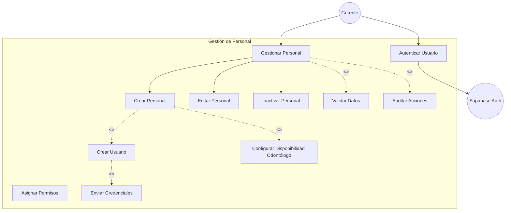
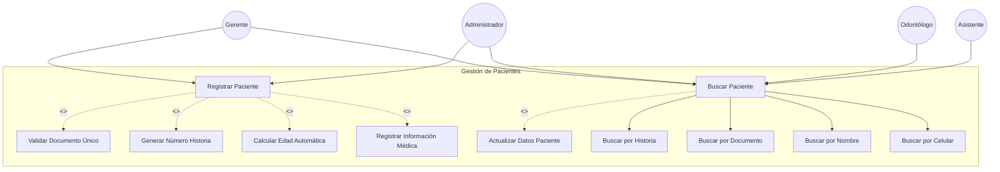
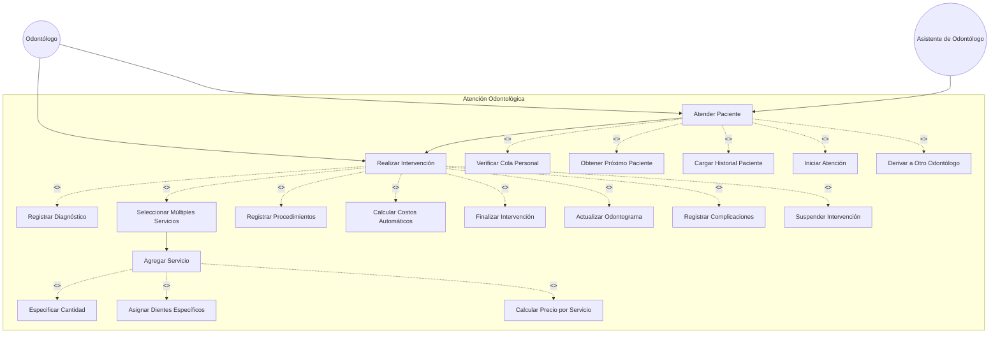
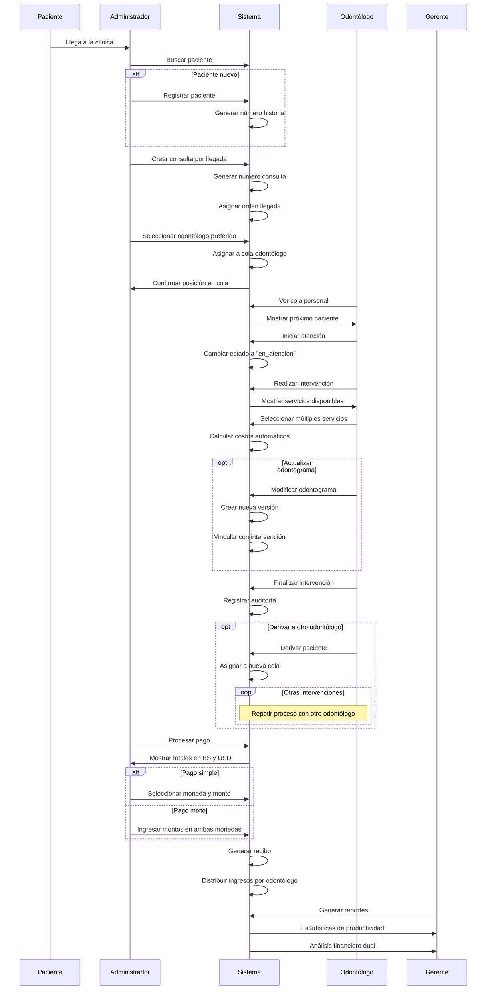
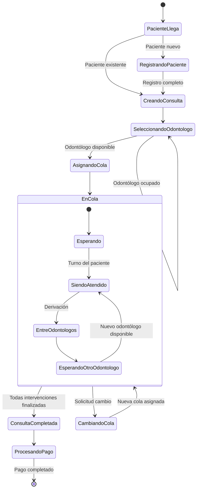

# DIAGRAMAS DE CASOS DE USO
## Sistema de Información Odontológico - Clínica Dental OdontoMara

**Versión:** 1.0  
**Fecha:** Agosto 2025  
**Metodología:** RUP (Rational Unified Process)  
**Fase:** Elaboración  

---

## 1. INTRODUCCIÓN

### 1.1 Propósito del Documento
Este documento presenta los diagramas de casos de uso del sistema odontológico, proporcionando una representación visual clara de las interacciones entre actores y funcionalidades del sistema.

### 1.2 Notación UML Utilizada
- **Actor:** Representa usuarios o sistemas externos que interactúan con el sistema
- **Caso de Uso:** Funcionalidad específica del sistema (óvalos)
- **Asociación:** Línea que conecta actor con caso de uso
- **Inclusión (<<include>>):** Caso de uso que siempre se ejecuta como parte de otro
- **Extensión (<<extend>>):** Caso de uso opcional que puede extender otro
- **Generalización:** Herencia entre actores o casos de uso

---

## 2. DIAGRAMA GENERAL DEL SISTEMA

```mermaid
graph TD
    %% Actores
    Gerente((Gerente))
    Admin((Administrador))
    Odontologo((Odontólogo))
    Asistente((Asistente))
    
    %% Sistema principal
    subgraph "Sistema Odontológico"
        %% Módulo de Gestión
        GestionPersonal[Gestionar Personal]
        ConfigurarSistema[Configurar Sistema]
        GenerarReportes[Generar Reportes]
        
        %% Módulo de Pacientes
        RegistrarPaciente[Registrar Paciente]
        BuscarPaciente[Buscar Paciente]
        
        %% Módulo de Consultas
        CrearConsulta[Crear Consulta por Llegada]
        GestionarCola[Gestionar Cola de Atención]
        CambiarOdontologo[Cambiar Odontólogo]
        
        %% Módulo de Atención
        AtenderPaciente[Atender Paciente]
        RealizarIntervencion[Realizar Intervención]
        DerivarPaciente[Derivar a Otro Odontólogo]
        
        %% Módulo de Odontograma
        ActualizarOdontograma[Actualizar Odontograma]
        ConsultarHistorial[Consultar Historial Odontograma]
        
        %% Módulo de Pagos
        ProcesarPagoSimple[Procesar Pago Simple]
        ProcesarPagoMixto[Procesar Pago Mixto]
        
        %% Casos base
        Autenticar[Autenticar Usuario]
    end
    
    %% Conexiones Gerente
    Gerente --> GestionPersonal
    Gerente --> ConfigurarSistema
    Gerente --> GenerarReportes
    Gerente --> RegistrarPaciente
    Gerente --> BuscarPaciente
    Gerente --> CrearConsulta
    Gerente --> GestionarCola
    Gerente --> CambiarOdontologo
    Gerente --> ConsultarHistorial
    Gerente --> ProcesarPagoSimple
    Gerente --> ProcesarPagoMixto
    Gerente --> Autenticar
    
    %% Conexiones Administrador
    Admin --> RegistrarPaciente
    Admin --> BuscarPaciente
    Admin --> CrearConsulta
    Admin --> GestionarCola
    Admin --> CambiarOdontologo
    Admin --> ProcesarPagoSimple
    Admin --> ProcesarPagoMixto
    Admin --> Autenticar
    
    %% Conexiones Odontólogo
    Odontologo --> BuscarPaciente
    Odontologo --> AtenderPaciente
    Odontologo --> RealizarIntervencion
    Odontologo --> DerivarPaciente
    Odontologo --> ActualizarOdontograma
    Odontologo --> ConsultarHistorial
    Odontologo --> Autenticar
    
    %% Conexiones Asistente
    Asistente --> BuscarPaciente
    Asistente --> GestionarCola
    Asistente --> ConsultarHistorial
    Asistente --> Autenticar
```

---

## 3. DIAGRAMAS POR MÓDULO

### 3.1 MÓDULO DE GESTIÓN DE PERSONAL

### 3.2 MÓDULO DE GESTIÓN DE PACIENTES

### 3.3 MÓDULO DE CONSULTAS Y COLAS (CARACTERÍSTICA PRINCIPAL)

```mermaid
graph TD
    %% Actores
    Gerente((Gerente))
    Admin((Administrador))
    Paciente((Paciente))
    
    subgraph "Sistema de Consultas por Orden de Llegada"
        %% Proceso principal
        CrearConsulta[Crear Consulta por Llegada]
        GestionarColas[Gestionar Colas por Odontólogo]
        
        %% Casos incluidos obligatorios
        ValidarPaciente[Validar Paciente Registrado]
        GenerarNumeroConsulta[Generar Número Consulta]
        AsignarOrdenLlegada[Asignar Orden de Llegada]
        AsignarColaOdontologo[Asignar a Cola de Odontólogo]
        CalcularTiempoEspera[Calcular Tiempo de Espera]
        ActualizarEstadisticas[Actualizar Estadísticas Cola]
        
        %% Casos extendidos opcionales
        SeleccionarOdontologoPreferido[Seleccionar Odontólogo Preferido]
        CambiarOdontologo[Cambiar Odontólogo]
        MarcarUrgencia[Marcar como Urgencia]
        
        %% Gestión específica de colas
        VerProximoPaciente[Ver Próximo Paciente]
        MonitorearColas[Monitorear Todas las Colas]
        ReasignarPaciente[Reasignar Paciente]
        
        %% Estados de consulta
        MarcarEnEspera[Marcar En Espera]
        MarcarEnAtencion[Marcar En Atención]
        MarcarEntreOdontologos[Marcar Entre Odontólogos]
        MarcarCompletada[Marcar Completada]
    end
    
    %% Conexiones actores
    Admin --> CrearConsulta
    Admin --> GestionarColas
    Gerente --> CrearConsulta
    Gerente --> GestionarColas
    Paciente --> CrearConsulta
    
    %% Flujo principal obligatorio
    CrearConsulta -.->|<<include>>| ValidarPaciente
    CrearConsulta -.->|<<include>>| GenerarNumeroConsulta
    CrearConsulta -.->|<<include>>| AsignarOrdenLlegada
    CrearConsulta -.->|<<include>>| AsignarColaOdontologo
    CrearConsulta -.->|<<include>>| CalcularTiempoEspera
    CrearConsulta -.->|<<include>>| ActualizarEstadisticas
    CrearConsulta -.->|<<include>>| MarcarEnEspera
    
    %% Extensiones opcionales
    CrearConsulta -.->|<<extend>>| SeleccionarOdontologoPreferido
    CrearConsulta -.->|<<extend>>| MarcarUrgencia
    GestionarColas -.->|<<extend>>| CambiarOdontologo
    
    %% Especialización de gestión de colas
    GestionarColas --> VerProximoPaciente
    GestionarColas --> MonitorearColas
    GestionarColas --> ReasignarPaciente
    
    %% Flujo de estados
    AsignarColaOdontologo --> MarcarEnEspera
    MarcarEnEspera --> MarcarEnAtencion
    MarcarEnAtencion --> MarcarEntreOdontologos
    MarcarEntreOdontologos --> MarcarCompletada
```

### 3.4 MÓDULO DE ATENCIÓN ODONTOLÓGICA

### 3.5 MÓDULO DE ODONTOGRAMA DIGITAL (CARACTERÍSTICA AVANZADA)

```mermaid
graph TD
    %% Actores
    Odontologo((Odontólogo))
    
    subgraph "Odontograma Digital Interactivo"
        %% Funcionalidad principal
        ActualizarOdontograma[Actualizar Odontograma]
        ConsultarHistorial[Consultar Historial Odontograma]
        
        %% Casos incluidos en actualización
        CargarOdontogramaActual[Cargar Odontograma Actual]
        SeleccionarDiente[Seleccionar Diente FDI]
        DefinirCondicion[Definir Condición Dental]
        SeleccionarCaras[Seleccionar Caras Afectadas]
        AgregarMaterial[Agregar Material Utilizado]
        
        %% Versionado automático
        DetectarCambios[Detectar Cambios Significativos]
        CrearNuevaVersion[Crear Nueva Versión]
        VincularIntervencion[Vincular con Intervención]
        CalcularEstadisticas[Calcular Estadísticas]
        
        %% Consulta de historial
        ListarVersiones[Listar Versiones Históricas]
        CompararVersiones[Comparar Versiones]
        GenerarReporteEvolucion[Generar Reporte Evolución]
        
        %% Tipos de condiciones
        MarcarSano[Marcar como Sano]
        MarcarCaries[Marcar Caries]
        MarcarObturacion[Marcar Obturación]
        MarcarCorona[Marcar Corona]
        MarcarAusente[Marcar Ausente]
        MarcarOtros[Marcar Otras Condiciones]
    end
    
    %% Conexiones
    Odontologo --> ActualizarOdontograma
    Odontologo --> ConsultarHistorial
    
    %% Flujo de actualización
    ActualizarOdontograma -.->|<<include>>| CargarOdontogramaActual
    ActualizarOdontograma -.->|<<include>>| SeleccionarDiente
    ActualizarOdontograma -.->|<<include>>| DefinirCondicion
    ActualizarOdontograma -.->|<<include>>| SeleccionarCaras
    
    %% Versionado automático
    ActualizarOdontograma -.->|<<include>>| DetectarCambios
    DetectarCambios -.->|<<include>>| CrearNuevaVersion
    CrearNuevaVersion -.->|<<include>>| VincularIntervencion
    CrearNuevaVersion -.->|<<include>>| CalcularEstadisticas
    
    %% Extensiones opcionales
    DefinirCondicion -.->|<<extend>>| AgregarMaterial
    
    %% Flujo de consulta histórica
    ConsultarHistorial -.->|<<include>>| ListarVersiones
    ConsultarHistorial -.->|<<include>>| CompararVersiones
    ConsultarHistorial -.->|<<extend>>| GenerarReporteEvolucion
    
    %% Tipos de condiciones (especialización)
    DefinirCondicion --> MarcarSano
    DefinirCondicion --> MarcarCaries
    DefinirCondicion --> MarcarObturacion
    DefinirCondicion --> MarcarCorona
    DefinirCondicion --> MarcarAusente
    DefinirCondicion --> MarcarOtros
```

### 3.6 MÓDULO DE PAGOS MIXTOS (CARACTERÍSTICA ÚNICA)

```mermaid
graph TD
    %% Actores
    Gerente((Gerente))
    Admin((Administrador))
    
    subgraph "Sistema de Pagos Mixtos BS/USD"
        %% Tipos de pago principales
        ProcesarPagoSimple[Procesar Pago Simple]
        ProcesarPagoMixto[Procesar Pago Mixto]
        
        %% Casos incluidos comunes
        CargarConsulta[Cargar Consulta a Pagar]
        MostrarTotales[Mostrar Totales en Ambas Monedas]
        ValidarMontos[Validar Montos vs Saldos]
        RegistrarTasaCambio[Registrar Tasa de Cambio]
        GenerarRecibo[Generar Recibo]
        DistribuirIngresos[Distribuir Ingresos por Odontólogo]
        
        %% Específicos de pago simple
        SeleccionarMoneda[Seleccionar Moneda única]
        IngresarMontoSimple[Ingresar Monto Simple]
        SeleccionarMetodoPago[Seleccionar Método de Pago]
        
        %% Específicos de pago mixto
        IngresarMontoBS[Ingresar Monto en BS]
        IngresarMontoUSD[Ingresar Monto en USD]
        SeleccionarMetodoBS[Seleccionar Método para BS]
        SeleccionarMetodoUSD[Seleccionar Método para USD]
        ValidarCalculosEquivalencia[Validar Cálculos Equivalencia]
        
        %% Casos extendidos
        AplicarDescuento[Aplicar Descuento]
        PagosParciales[Procesar Pagos Parciales]
        AnularPago[Anular Pago]
        
        %% Distribución automática
        CalcularComisionOdontologo[Calcular por Odontólogo]
        AsignarMonedaOriginal[Asignar Moneda Original]
    end
    
    %% Conexiones actores
    Gerente --> ProcesarPagoSimple
    Gerente --> ProcesarPagoMixto
    Admin --> ProcesarPagoSimple
    Admin --> ProcesarPagoMixto
    
    %% Flujo común
    ProcesarPagoSimple -.->|<<include>>| CargarConsulta
    ProcesarPagoMixto -.->|<<include>>| CargarConsulta
    ProcesarPagoSimple -.->|<<include>>| MostrarTotales
    ProcesarPagoMixto -.->|<<include>>| MostrarTotales
    ProcesarPagoSimple -.->|<<include>>| ValidarMontos
    ProcesarPagoMixto -.->|<<include>>| ValidarMontos
    ProcesarPagoSimple -.->|<<include>>| RegistrarTasaCambio
    ProcesarPagoMixto -.->|<<include>>| RegistrarTasaCambio
    ProcesarPagoSimple -.->|<<include>>| GenerarRecibo
    ProcesarPagoMixto -.->|<<include>>| GenerarRecibo
    ProcesarPagoSimple -.->|<<include>>| DistribuirIngresos
    ProcesarPagoMixto -.->|<<include>>| DistribuirIngresos
    
    %% Flujo específico pago simple
    ProcesarPagoSimple -.->|<<include>>| SeleccionarMoneda
    ProcesarPagoSimple -.->|<<include>>| IngresarMontoSimple
    ProcesarPagoSimple -.->|<<include>>| SeleccionarMetodoPago
    
    %% Flujo específico pago mixto
    ProcesarPagoMixto -.->|<<include>>| IngresarMontoBS
    ProcesarPagoMixto -.->|<<include>>| IngresarMontoUSD
    ProcesarPagoMixto -.->|<<include>>| SeleccionarMetodoBS
    ProcesarPagoMixto -.->|<<include>>| SeleccionarMetodoUSD
    ProcesarPagoMixto -.->|<<include>>| ValidarCalculosEquivalencia
    
    %% Extensiones
    ProcesarPagoSimple -.->|<<extend>>| AplicarDescuento
    ProcesarPagoMixto -.->|<<extend>>| AplicarDescuento
    ProcesarPagoSimple -.->|<<extend>>| PagosParciales
    ProcesarPagoMixto -.->|<<extend>>| PagosParciales
    
    %% Distribución automática
    DistribuirIngresos -.->|<<include>>| CalcularComisionOdontologo
    DistribuirIngresos -.->|<<include>>| AsignarMonedaOriginal
```

### 3.7 MÓDULO DE REPORTES GERENCIALES

```mermaid
graph TD
    %% Actores
    Gerente((Gerente))
    
    subgraph "Reportes y Estadísticas"
        %% Reportes principales
        GenerarReporteProductividad[Generar Reporte Productividad]
        GenerarReporteFinanciero[Generar Reporte Financiero]
        GenerarReporteOperativo[Generar Reporte Operativo]
        
        %% Casos incluidos
        SeleccionarPeriodo[Seleccionar Período]
        AplicarFiltros[Aplicar Filtros]
        ProcesarDatos[Procesar Datos]
        GenerarGraficos[Generar Gráficos]
        ExportarReporte[Exportar Reporte]
        
        %% Reportes específicos de productividad
        CalcularIntervencionesPorOdontologo[Intervenciones por Odontólogo]
        CalcularIngresosPorOdontologo[Ingresos por Odontólogo]
        AnalisisServiciosPopulares[Análisis Servicios Populares]
        CalcularTiemposAtencion[Calcular Tiempos Atención]
        
        %% Reportes financieros específicos
        AnalisisIngresosDuales[Análisis Ingresos BS/USD]
        EstadoPagosPendientes[Estado Pagos Pendientes]
        EvolucionFinanciera[Evolución Financiera]
        
        %% Reportes operativos
        EstadisticasColas[Estadísticas de Colas]
        AnalisisTiemposEspera[Análisis Tiempos Espera]
        RendimientoOperativo[Rendimiento Operativo]
    end
    
    %% Conexiones
    Gerente --> GenerarReporteProductividad
    Gerente --> GenerarReporteFinanciero
    Gerente --> GenerarReporteOperativo
    
    %% Flujo común
    GenerarReporteProductividad -.->|<<include>>| SeleccionarPeriodo
    GenerarReporteFinanciero -.->|<<include>>| SeleccionarPeriodo
    GenerarReporteOperativo -.->|<<include>>| SeleccionarPeriodo
    
    GenerarReporteProductividad -.->|<<include>>| AplicarFiltros
    GenerarReporteFinanciero -.->|<<include>>| AplicarFiltros
    GenerarReporteOperativo -.->|<<include>>| AplicarFiltros
    
    GenerarReporteProductividad -.->|<<include>>| ProcesarDatos
    GenerarReporteFinanciero -.->|<<include>>| ProcesarDatos
    GenerarReporteOperativo -.->|<<include>>| ProcesarDatos
    
    GenerarReporteProductividad -.->|<<include>>| GenerarGraficos
    GenerarReporteFinanciero -.->|<<include>>| GenerarGraficos
    GenerarReporteOperativo -.->|<<include>>| GenerarGraficos
    
    GenerarReporteProductividad -.->|<<extend>>| ExportarReporte
    GenerarReporteFinanciero -.->|<<extend>>| ExportarReporte
    GenerarReporteOperativo -.->|<<extend>>| ExportarReporte
    
    %% Especialización productividad
    GenerarReporteProductividad --> CalcularIntervencionesPorOdontologo
    GenerarReporteProductividad --> CalcularIngresosPorOdontologo
    GenerarReporteProductividad --> AnalisisServiciosPopulares
    GenerarReporteProductividad --> CalcularTiemposAtencion
    
    %% Especialización financiera
    GenerarReporteFinanciero --> AnalisisIngresosDuales
    GenerarReporteFinanciero --> EstadoPagosPendientes
    GenerarReporteFinanciero --> EvolucionFinanciera
    
    %% Especialización operativa
    GenerarReporteOperativo --> EstadisticasColas
    GenerarReporteOperativo --> AnalisisTiemposEspera
    GenerarReporteOperativo --> RendimientoOperativo
```

---

## 4. DIAGRAMAS DE FLUJO INTEGRADO

### 4.1 FLUJO PRINCIPAL DE ATENCIÓN (PROCESO COMPLETO)

### 4.2 FLUJO DE COLAS POR ODONTÓLOGO

---

## 5. MATRIZ DE TRAZABILIDAD CASOS DE USO vs REQUISITOS

| Caso de Uso | Requisitos Relacionados | Prioridad | Módulo |
|-------------|------------------------|-----------|--------|
| Gestionar Personal | RF-001, RF-002, RNF-003 | Alta | Gestión |
| Autenticar Usuario | RF-003, RNF-003, RNF-004 | Alta | Seguridad |
| Registrar Paciente | RF-004, RNF-005 | Alta | Pacientes |
| Buscar Paciente | RF-005 | Alta | Pacientes |
| Crear Consulta por Llegada | RF-006, RF-007 | Alta | Consultas |
| Gestionar Cola de Atención | RF-007, RF-008 | Alta | Consultas |
| Atender Paciente | RF-009 | Alta | Atención |
| Realizar Intervención | RF-009, RF-010, RF-011 | Alta | Atención |
| Actualizar Odontograma | RF-012, RF-013, RF-014 | Alta | Odontograma |
| Procesar Pago Simple | RF-015, RF-016 | Alta | Pagos |
| Procesar Pago Mixto | RF-015, RF-016, RF-017 | Alta | Pagos |
| Generar Reportes | RF-020, RF-021 | Media | Reportes |

---

## 6. CARACTERÍSTICAS ÚNICAS DESTACADAS

### 6.1 Sistema de Colas por Odontólogo
- **Innovación:** Cada odontólogo mantiene su propia cola independiente
- **Beneficio:** Optimiza tiempos de espera y especialización
- **Implementación:** Orden automático con posibilidad de reasignación

### 6.2 Pagos Mixtos BS/USD
- **Innovación:** Soporte nativo para dos monedas simultáneamente  
- **Beneficio:** Adaptación a realidad económica venezolana
- **Implementación:** Distribución automática por odontólogo en moneda original

### 6.3 Odontograma con Versionado
- **Innovación:** Historial completo de evolución dental
- **Beneficio:** Trazabilidad médica y análisis de tendencias
- **Implementación:** Creación automática de versiones al modificar

### 6.4 Múltiples Servicios por Intervención
- **Innovación:** Un odontólogo puede realizar varios servicios en una sesión
- **Beneficio:** Eficiencia operativa y facturación precisa
- **Implementación:** Cálculo automático de totales y distribución

---

**Documento preparado para:** Presentación de Tesis - Sistema Odontológico  
**Metodología:** RUP (Rational Unified Process)  
**Próximo paso:** Diseño de Arquitectura de Módulos